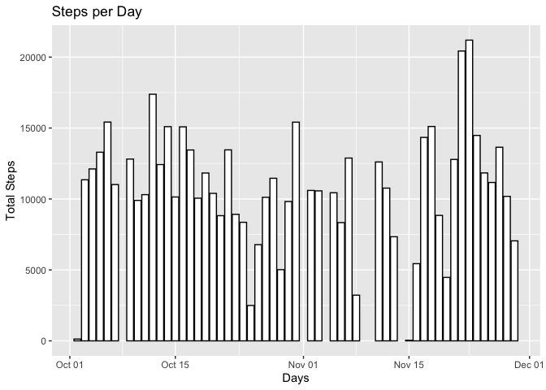
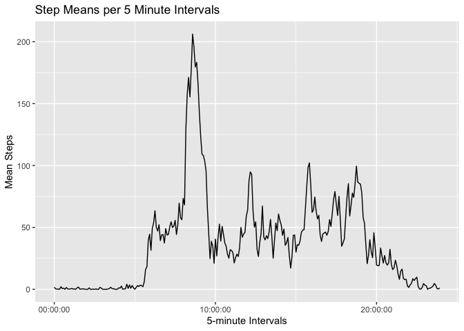
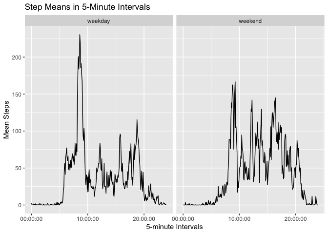

<hr style="height:30px">
<font color="blue"><h3>1)</font> Loading and preprocessing the data</h3>


```r
library(ggplot2, warn.conflicts = FALSE)
library(dplyr, warn.conflicts = FALSE)
library(lubridate, warn.conflicts = FALSE)

# Read in data
activities <- read.csv(unzip("activity.zip"))      # 17568 X 3 dataframe

# Lubridate as_datetime function changes 2nd column to datetime:
activities$date <- as_datetime(activities$date) 
```
<hr style="height:30px">
<font color="blue"><h3>2)</font> What is the mean total number of steps taken per day?</h3>

<p>Calculate the total number of steps taken per day:   


```r
grouped_activities <- activities %>% 
  na.omit(activities) %>%    # Now a 15264 X 3 dataframe
  group_by(date) %>%
  summarize(sum_steps=sum(steps), .groups = 'drop') 
```

Make a histogram of the total number of steps per day.       

 
 ```r
  ggplot(grouped_activities,aes(x=date, y=sum_steps)) + 
  geom_bar(stat="identity", fill = "white", colour = "black") +
  ggtitle("Steps per Day ") +
  labs(x="Days", y = "Total Steps")
 ```
 
 <!-- -->

<p>
Calculate the mean and median of the total number of steps per day

 
 ```r
 mean(grouped_activities$sum_steps)
 ```
 
 ```
 ## [1] 10766.19
 ```
 
 ```r
 median(grouped_activities$sum_steps)
 ```
 
 ```
 ## [1] 10765
 ```
<hr style="height:30px">
<font color="blue"><h3>3)</font> What is the average daily activity pattern?</h3>
Make a time series plot of the 5-minute interval (x-axis) and the    
average number of steps taken, averaged across all days (y-axis).


```r
stepsInterval <- activities %>%
  na.omit(activities) %>%    # Now a 15264 X 3 dataframe
  group_by(interval) %>%
  summarize(mean_steps=mean(steps), .groups = 'drop') 
```

**stepsInterval** is a dataframe of 288 five-minute intervals and their means.   
To make a time-series plot we need to convert these intervals to time periods.


```r
# First create column containing total seconds elapsed:
seconds_vector <- (stepsInterval$interval%/%100) * 60 * 60 + stepsInterval$interval%%100 *60

# Now use Lubridate function to convert seconds to a period of time:
stepsInterval$time <-hms::as_hms(seconds_vector)
```
Now we can use ggplot2 to make a time series plot:


```r
ggplot(stepsInterval, aes(x=time, y=mean_steps)) + 
  geom_line() +
  ggtitle("Step Means per 5 Minute Intervals") +
  labs(x="5-minute Intervals", y = "Mean Steps")
```

<!-- -->

Which 5-minute interval contains the maximum number of steps?


```r
stepsInterval$time[which.max(stepsInterval$mean_steps)]
```

```
## 08:35:00
```

Or presented in the original data format...  
The 5-minute interval:


```r
stepsInterval$interval[which.max(stepsInterval$mean_steps)]
```

```
## [1] 835
```


<hr style="height:30px">
<font color="blue"><h3>4)</font> Imputing missing values</h3>

Note that there are a number of days/intervals where there are missing values.  
The presence of missing days may introduce bias into calculations of the data.


<p>
Calculate and report the total number of missing values in the dataset:
</p>

```r
sum(is.na(activities$steps)) 
```

```
## [1] 2304
```


Devise a strategy for filling in all of the missing values in the dataset.  
The strategy does not need to be sophisticated. For example, you could use  
the mean/median for that day, or the mean for that 5-minute interval, etc.

Create a new dataset that is equal to the original dataset but with the missing data filled in:


```r
# Strategy: Replace NA's with mean of the 5-minute intervals from
# the dataframe "stepsInterval" created above in part 3.

# Vector of indices for NAs
missing_steps <- which(is.na(activities$steps)) 

for (i in missing_steps) {
  # Get the time interval whose step count is NA
  time_interval <- activities$interval[i]
  # Locate that interval in "stepsInterval"
  location <- which(stepsInterval$interval == time_interval)
  # Assign the step mean to the NA:
  activities$steps[i] <- stepsInterval$mean_steps[location]
}
```

Make a histogram of the total number of steps taken each day: 


```r
imputed_activities <- activities %>% 
  group_by(date) %>%
  summarize(sum_steps=sum(steps), .groups = 'drop')


  ggplot(imputed_activities,aes(x=date, y=sum_steps)) + 
  geom_bar(stat="identity", fill = "white", colour = "black") +
  ggtitle("Steps per Day ") +
  labs(x="Days", y = "Total Steps")
```

<!-- -->

Calculate the mean and median total number of steps per day.  
Do these values differ from those in Part 3?


```r
# Mean from Part 3: 10766.19
mean(imputed_activities$sum_steps)
```

```
## [1] 10766.19
```

```r
# Median from Part 3: 10765
median(imputed_activities$sum_steps)
```

```
## [1] 10766.19
```

Since my imputed values used means there was no change in that metric.  
However the median got pushed a bit ahead because of the  newly included values.


<hr style="height:30px">
<font color="blue"><h3>5)</font> Are there differences in activity patterns between weekdays and weekends?</h3>

Create a new factor variable in the dataset with two levels:  
"weekday" and "weekend" indicating each for all given dates.


```r
my_weekends <- c("Saturday", "Sunday")
activities$weekends <- factor((weekdays(activities$date) %in% my_weekends), 
                   levels=c(FALSE, TRUE), labels=c("weekday", "weekend"))
```

Make a panel plot containing a time series plot of the 5-minute interval  
and the average number of steps taken, averaged across all weekday/weekend days. 


```r
stepsInterval <- activities %>%
  group_by(weekends, interval) %>%
  summarize(mean_steps=mean(steps), .groups = 'drop') 
```

**stepsInterval** is a dataframe of 576 five-minute intervals and their means.   
To make a time-series plot we need to convert these intervals to time periods.


```r
# Create column containing total seconds elapsed:
seconds_vector <- (stepsInterval$interval%/%100) * 60 * 60 + stepsInterval$interval%%100 *60

# Use Lubridate function to convert seconds to a period of time:
stepsInterval$time <-hms::as_hms(seconds_vector)
```

Now we can use ggplot2 to make time series panel plots:


```r
ggplot(stepsInterval, aes(x=time, y=mean_steps)) + 
  geom_line() +
  ggtitle("Step Means in 5-Minute Intervals") +
  labs(x="5-minute Intervals", y = "Mean Steps") +
  facet_wrap(~ weekends)
```

<!-- -->

When the step data is separated this way...  
It appears the person was more consistently active on weekends.
